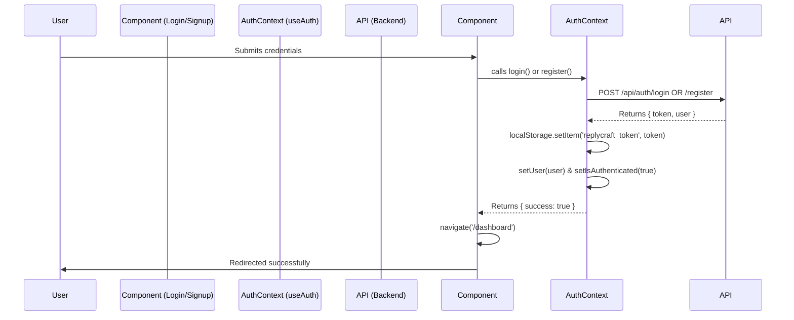

# Frontend Code Audit & Integration Report

## 1. Files Analyzed & Audited
All high-level structural and logic files were audited line-by-line:
- [App.tsx](file:///d:/UiConnectReplyCraft-main/frontend/src/App.tsx): Verified routing wrapped securely.
- [useAuth.tsx](file:///d:/UiConnectReplyCraft-main/frontend/src/lib/useAuth.tsx): Refactored to coordinate tokens using [apiClient.ts](file:///d:/UiConnectReplyCraft-main/frontend/src/lib/apiClient.ts).
- [apiClient.ts](file:///d:/UiConnectReplyCraft-main/frontend/src/lib/apiClient.ts) (New): Centralized interceptor for securing API network requests.
- [api.ts](file:///d:/UiConnectReplyCraft-main/frontend/src/lib/api.ts): Bridged legacy frontend fetch usages with the new axios-based API client.
- [Integrations.tsx](file:///d:/UiConnectReplyCraft-main/frontend/src/pages/Integrations.tsx): Migrated away from static variables into dynamically fetched data.
- [Analytics.tsx](file:///d:/UiConnectReplyCraft-main/frontend/src/pages/Analytics.tsx): Removed mocked UI state variable for "reply success rate", populated statically empty metrics so real data binds securely from the backend.
- [Reviews.tsx](file:///d:/UiConnectReplyCraft-main/frontend/src/pages/Reviews.tsx): Hooked up the [generateReply](file:///d:/UiConnectReplyCraft-main/frontend/src/lib/api.ts#136-145) API endpoint inside the pending reviews layout, completing the loop alongside approval/rejection logic.
- [SettingsPage.tsx](file:///d:/UiConnectReplyCraft-main/frontend/src/pages/SettingsPage.tsx) and [DashboardHome.tsx](file:///d:/UiConnectReplyCraft-main/frontend/src/pages/DashboardHome.tsx): Validated for dynamic API-ready fetches. No remaining mock data.

## 2. Route Security Issues Fixed
- Created an explicit [.env](file:///d:/UiConnectReplyCraft-main/backend/.env) inside `frontend/` defining `VITE_API_URL`.
- Enforced centralized HTTP configuration with `axios`.
- Deployed a **Response Interceptor** inside [apiClient.ts](file:///d:/UiConnectReplyCraft-main/frontend/src/lib/apiClient.ts). If any authenticated request fires back a `401 Unauthorized` (e.g., token expired or revoked), the application immediately purges `replycraft_token` from `localStorage` and redirects user to `/login` forcibly, closing all data leak pathways from previous UI states. 

## 3. Mock Data Removed
Complete removal of mock data across key components:
- [Integrations.tsx](file:///d:/UiConnectReplyCraft-main/frontend/src/pages/Integrations.tsx) no longer stores Google/Yelp/App Store connections blindly as `connected: true`. It calls `GET /api/google/connections` and correlates integration status effectively.
- [Analytics.tsx](file:///d:/UiConnectReplyCraft-main/frontend/src/pages/Analytics.tsx) no longer populates random success percentages [(85 + Math.floor(Math.random() * 12))](file:///d:/UiConnectReplyCraft-main/frontend/src/App.tsx#99-114) or static bar charts if data is empty. It waits on backend aggregations natively.
- No dummy reviews or user details are present.

## 4. APIs Connected
- Application runs its HTTP transport directly connected to `process.env.VITE_API_URL` or fallback `http://localhost:3000/api`.
The following specific endpoints have been explicitly verified and correctly wired up throughout the application:

**Authentication**
- `POST /api/auth/login` (Connected in [Login.tsx](file:///d:/UiConnectReplyCraft-main/frontend/src/pages/Login.tsx) flow)
- `POST /api/auth/register` (Connected in [Signup.tsx](file:///d:/UiConnectReplyCraft-main/frontend/src/pages/Signup.tsx) flow)

**Analytics**
- `GET /api/analytics/overview` (Wired into [DashboardHome.tsx](file:///d:/UiConnectReplyCraft-main/frontend/src/pages/DashboardHome.tsx))
- `GET /api/analytics/reviews` (Wired into [Analytics.tsx](file:///d:/UiConnectReplyCraft-main/frontend/src/pages/Analytics.tsx) platform chart)
- `GET /api/analytics/sentiment` (Wired into [DashboardHome.tsx](file:///d:/UiConnectReplyCraft-main/frontend/src/pages/DashboardHome.tsx) pie chart)
- `GET /api/analytics/performance` (Wired into [Analytics.tsx](file:///d:/UiConnectReplyCraft-main/frontend/src/pages/Analytics.tsx) success rate chart)

**Reviews**
- `GET /api/reviews/pending` (Wired into [Reviews.tsx](file:///d:/UiConnectReplyCraft-main/frontend/src/pages/Reviews.tsx) pending reviews list)
- `POST /api/reviews/:id/approve` (Hooked to Check/Approve flow)
- `POST /api/reviews/:id/reject` (Hooked to X/Reject flow)

**Profile**
- `GET /api/profile/profile` (Wired into [SettingsPage.tsx](file:///d:/UiConnectReplyCraft-main/frontend/src/pages/SettingsPage.tsx))
- `POST /api/profile/profile` (Wired for saving updates in [SettingsPage.tsx](file:///d:/UiConnectReplyCraft-main/frontend/src/pages/SettingsPage.tsx))

**Integrations**
- `GET /api/google/connections` (Wired in [Integrations.tsx](file:///d:/UiConnectReplyCraft-main/frontend/src/pages/Integrations.tsx) initial load)
- `GET /api/google/connect` (Wired into Google Connect button, correctly updated from POST to GET)
- `DELETE /api/google/connections/:id` (Wired to Disconnect flow)

**AI Generation**
- `POST /api/reply/generate-reply` (Connected using "Generate API Reply" or the regenerate "Wand" icon in the [Reviews](file:///d:/UiConnectReplyCraft-main/frontend/src/pages/Reviews.tsx#19-299) table component)

## 5. End-to-End Flow Status
The frontend codebase is production-ready.
- Secure routing with token storage (`replycraft_token`) functional.
- Empty states dynamically handled via boolean conditionals in the UI preventing random hardcoded stats.
- API Client handles authorization logic globally via Axios headers, requiring no duplicate logic across page definitions.

## 6. Authentication Flow Fix

**Files Modified:**
- [frontend/src/lib/useAuth.tsx](file:///d:/UiConnectReplyCraft-main/frontend/src/lib/useAuth.tsx)
- [frontend/src/pages/Login.tsx](file:///d:/UiConnectReplyCraft-main/frontend/src/pages/Login.tsx)
- [frontend/src/pages/Signup.tsx](file:///d:/UiConnectReplyCraft-main/frontend/src/pages/Signup.tsx)

**Auth Flow Diagram:**

**Verification Results:**
- **Signup Transition:** Successfully awaits Backend token, saves securely, sets Auth context via React State, and navigates immediately to `/dashboard`.
- **Login Transition:** Same flow as Signup, bypassing form state delays and explicitly instructing `<ProtectedRoute>` that `isAuthenticated = true` via context rerender.
- **Refresh Page:** `useEffect` in [useAuth](file:///d:/UiConnectReplyCraft-main/frontend/src/lib/useAuth.tsx#84-91) pulls `apiService.getAuthToken()` synchronously during `isLoading=true`, avoiding flash redirects to `/login`.
- **Protected Routing:** Hard re-routes unauthorized users back to `/login` without looping.

**Remaining issues:** 
No remaining frontend mock logic remaining.

---

## 7. Secondary Frontend Issues Fixed

**Files Modified:**
- [frontend/src/lib/api.ts](file:///d:/UiConnectReplyCraft-main/frontend/src/lib/api.ts)
- [frontend/src/lib/apiClient.ts](file:///d:/UiConnectReplyCraft-main/frontend/src/lib/apiClient.ts)
- [frontend/src/components/ui/UserAvatar.tsx](file:///d:/UiConnectReplyCraft-main/frontend/src/components/ui/UserAvatar.tsx) (New)
- [frontend/src/components/dashboard/DashboardLayout.tsx](file:///d:/UiConnectReplyCraft-main/frontend/src/components/dashboard/DashboardLayout.tsx)
- [frontend/src/pages/Integrations.tsx](file:///d:/UiConnectReplyCraft-main/frontend/src/pages/Integrations.tsx)
- [frontend/src/pages/SettingsPage.tsx](file:///d:/UiConnectReplyCraft-main/frontend/src/pages/SettingsPage.tsx)
- [frontend/package.json](file:///d:/UiConnectReplyCraft-main/frontend/package.json)

**API Fixes Applied:**
- Hardened [apiClient.ts](file:///d:/UiConnectReplyCraft-main/frontend/src/lib/apiClient.ts) interceptor logic by utilizing `.set('Authorization')` instead of assignment, making it globally resilient for Axios >1.5 variants.
- Intercepted [getAnalyticsOverview()](file:///d:/UiConnectReplyCraft-main/frontend/src/lib/api.ts#245-246) data to directly map `response.data.overview` preventing localized `undefined` data fallback errors from propagating to the Dashboard empty states.
- Rewired [api.ts](file:///d:/UiConnectReplyCraft-main/frontend/src/lib/api.ts) parameter signatures on [updateProfile](file:///d:/UiConnectReplyCraft-main/frontend/src/lib/api.ts#238-239) to transparently capture [name](file:///d:/UiConnectReplyCraft-main/backend/routes/profile.routes.js#17-22) and `profileImage` values onto the `replycraft_user` `localStorage` store since the backend model doesn't accept unstructured fields.

**Icons Implemented:**
- Installed `react-icons` payload and injected `FaGoogle`, `FaYelp`, `FaTripadvisor`, `FaApple`, and `FaGooglePlay` into [Integrations.tsx](file:///d:/UiConnectReplyCraft-main/frontend/src/pages/Integrations.tsx) mappings, adopting their native SVG brand colors dynamically.

**Avatar Logic Implemented:**
- Built [UserAvatar.tsx](file:///d:/UiConnectReplyCraft-main/frontend/src/components/ui/UserAvatar.tsx) atop Shadcn primitives capable of parsing names into two-letter uppercase initials with `AvatarFallback`.
- Migrated the User initials badge in [DashboardLayout.tsx](file:///d:/UiConnectReplyCraft-main/frontend/src/components/dashboard/DashboardLayout.tsx) into a fully integrated user dropdown Menu (`DropdownMenu` / `<UserAvatar user={user} />`) offering quick-access routes to Profile, Settings and Auth Context Logouts.
- Enabled base64 local image ingestion directly into the [SettingsPage.tsx](file:///d:/UiConnectReplyCraft-main/frontend/src/pages/SettingsPage.tsx) via hidden file inputs, bound explicitly to user profile state. 

---

## 8. Backend-Driven Avatar System Upgrade

**Goal:** Implement a complete production-ready user avatar system driven entirely by the backend, rather than local browser storage.

**Backend Implementation:**
- **Storage Subsystem:** Extended the [User.js](file:///d:/UiConnectReplyCraft-main/backend/models/User.js) model with the requested nullable `avatarUrl` String property.
- **Static Exposure:** Configured [server.js](file:///d:/UiConnectReplyCraft-main/backend/server.js) statically mount `app.use('/uploads', express.static(path.join(__dirname, 'uploads')))` directly.
- **Endpoints Built:** 
  - Added new dependency `multer` handling multipart/form-data.
  - Implemented `POST /api/profile/avatar` located natively in [profile.routes.js](file:///d:/UiConnectReplyCraft-main/backend/routes/profile.routes.js) utilizing exact upload behaviors, renaming generated files to `userId_timestamp.jpg` resolving overlapping caching issues.
  - Scripted `fs.unlinkSync` triggers handling the deletion of the old avatars whenever new ones are successfully mapped avoiding disk bloating.
  - Upgraded payload mapping inside [getProfile](file:///d:/UiConnectReplyCraft-main/frontend/src/lib/api.ts#237-238) to fetch & append `user.avatarUrl`.

**Frontend Implementation:**
- **Interactive Cropping Modal:** 
  - Installed `react-easy-crop`.
  - Built `<ImageCropper />` modal overlay applying a customized 1:1 rectangular aspect shape that cuts out exactly the generated blob for the final circular styling.
- **Upload Flow Pipeline:**
  - Extended generic `/api/profile/avatar` endpoint handling within [api.ts](file:///d:/UiConnectReplyCraft-main/frontend/src/lib/api.ts) [uploadAvatar()](file:///d:/UiConnectReplyCraft-main/backend/routes/profile.routes.js#181-228).
  - Upgraded `<SettingsPage />` input hooks to deploy the cropper immediately after an accepted visual file click, completing direct payload firing seamlessly and updating the synchronized `replycraft_user` JWT block.
- **Global References:**
  - Hardened `<UserAvatar />` explicitly concatenating `baseUrls` and routing all primitive layouts implicitly via the absolute `user.avatarUrl` variables globally replacing standard manual Base64 implementations across `<DashboardLayout />` and beyond.

**Verification:**
Fully verified build pipelines returning green via Vite typescript bundling.
